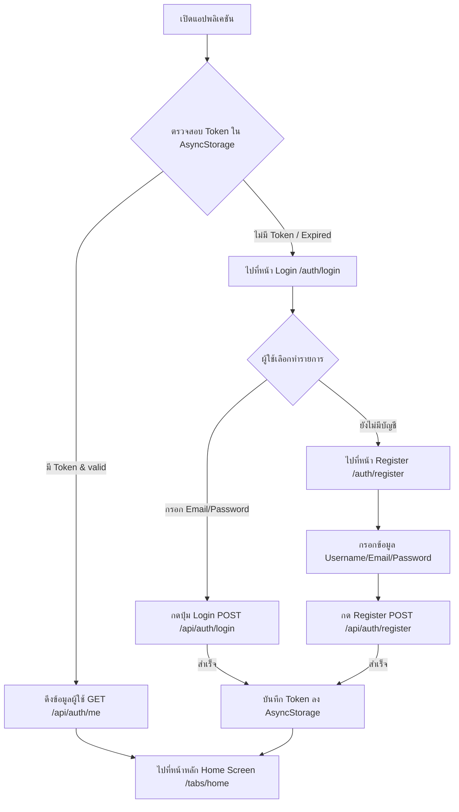
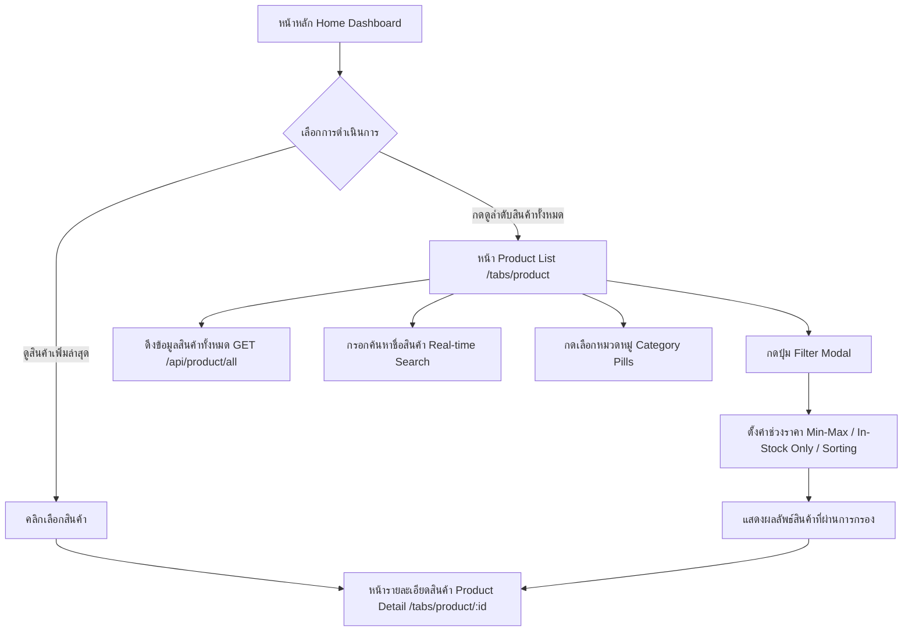
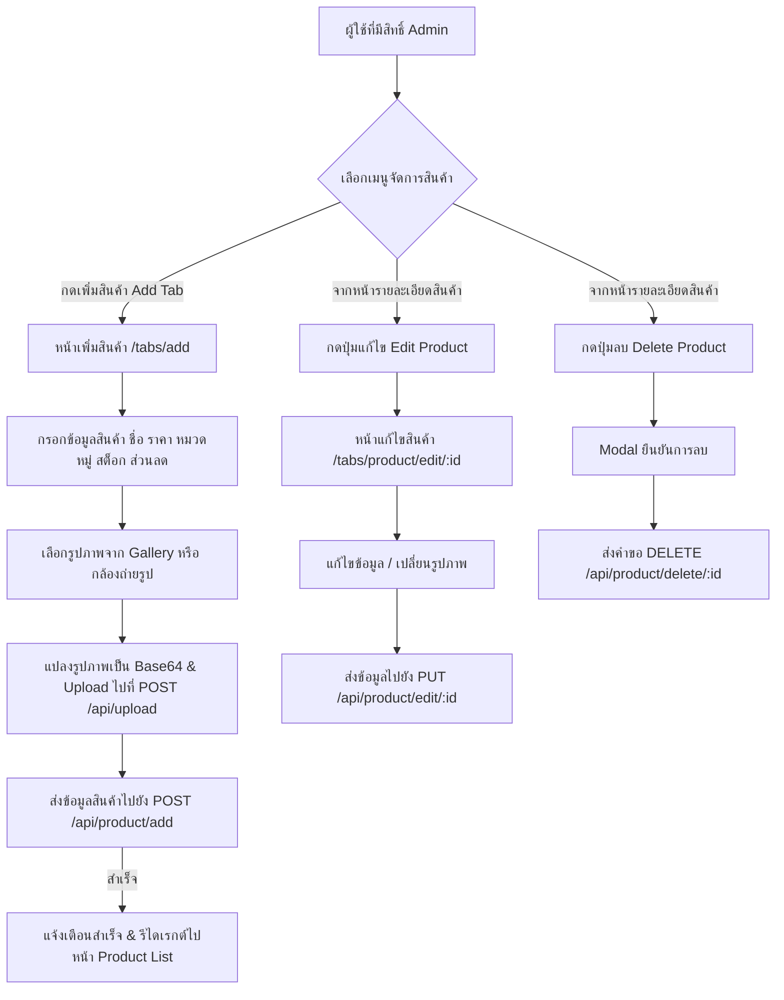
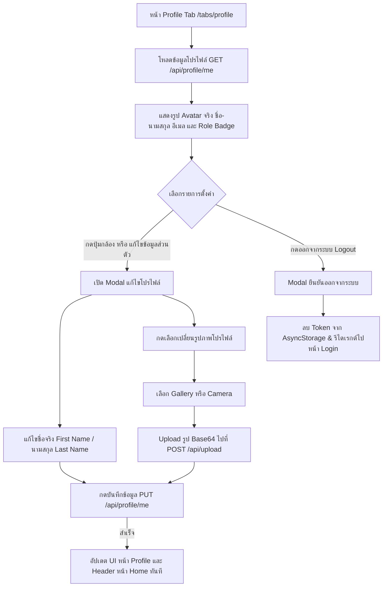

# 📱 Mobile Application User Flow & Production Readiness Assessment

เอกสารอธิบายลำดับขั้นตอนการใช้งานของผู้ใช้ (User Flow) และการประเมินความพร้อมสู่สภาวะการใช้งานจริง (Production Readiness Assessment) สำหรับแอปพลิเคชัน React Native Expo

---

## 📑 1. สรุปภาพรวม User Flows ในระบบ (Current User Flows)

### 🔄 Flow 1: Authentication & Onboarding (การเข้าสู่ระบบ & เริ่มต้นใช้งาน)

---

### 🛍️ Flow 2: Product Discovery & Filtering (การค้นหา & เลือกดูสินค้า)

---

### ⚙️ Flow 3: Product Management (การจัดการสินค้า - Admin Only)

---

### 👤 Flow 4: User Profile & Avatar Management (การจัดการโปรไฟล์ส่วนตัว)

---

## 🚀 2. การประเมินความพร้อมสู่ Production (Production Readiness Assessment)

### 🟢 จุดแข็งที่มีอยู่แล้ว (Current Strengths)
- ✅ **Architecture ที่เป็นสัดส่วน:** แยกเลเยอร์ชัดเจน (`src/api`, `src/features`, `src/shared`, `src/types`)
- ✅ **Role-Based Access Protection:** ควบคุมสิทธิ์ปุ่มและการเข้าถึงระหว่าง `user` และ `admin` ชัดเจน
- ✅ **Full Profile & Base64 Avatar Support:** รองรับการอัปโหลดและอัปเดตข้อมูลโปรไฟล์ผู้ใช้อย่างครบถ้วน
- ✅ **Clean UI & Responsive Aesthetics:** ดีไซน์หน้าจอทันสมัย ใช้งานง่าย มี Feedback สถิติ และสถานะการโหลด

---

## ⚠️ 3. ส่วนที่ยังขาด & ข้อแนะนำสำหรับการขึ้น Production (Production Gaps & Recommendations)

### 🔴 3.1 สิ่งที่ต้องมีก่อนขึ้น Production (Critical Production Blockers)

1. **🔒 Secure Token Storage (`expo-secure-store`)**
   - **สถานะปัจจุบัน:** ใช้ `@react-native-async-storage/async-storage` ซึ่งเก็บบันทึก Token เป็น Plaintext
   - **ข้อแนะนำ:** ควรเปลี่ยนมาใช้ `expo-secure-store` สำหรับ iOS Keychain และ Android Keystore เพื่อป้องกันการถูกขโมย JWT Token

2. **🌐 Offline & Network Loss Handling**
   - **สถานะปัจจุบัน:** หากไม่มีสัญญาณอินเทอร์เน็ต แอปจะแสดง Alert Error หรือค้างหมุน ActivityIndicator
   - **ข้อแนะนำ:** เพิ่ม **Network Connectivity Listener** (เช่น `@react-native-community/netinfo`) แสดง Offline Banner ด้านบน และมีปุ่ม **Pull-to-Refresh** ในทุกหน้า

3. **🔄 Auto Logout & Token Expiration Interceptor**
   - **สถานะปัจจุบัน:** Axios Interceptor จัดการ HTTP 401 เพียงส่ง Error กลับมา
   - **ข้อแนะนำ:** เพิ่ม Global Response Interceptor ให้ทำการลบ Token และเด้งรีไดเรกต์ผู้ใช้กลับหน้า Login ทันทีหากเซิร์ฟเวอร์ตอบกลับ 401 Unauthorized หรือ Token หมดอายุ

4. **⚡ Image Caching & Optimization (`expo-image`)**
   - **สถานะปัจจุบัน:** ใช้ `<Image />` มาตรฐานจาก `react-native`
   - **ข้อแนะนำ:** เปลี่ยนมาใช้ `expo-image` เพื่อเพิ่มประสิทธิภาพ Disk/Memory Caching ลดการโหลดรูปซ้ำ และรองรับ BlurHash placeholder

---

### 🟡 3.2 ส่วนที่ควรเพิ่มเพื่อยกระดับ UX/UI (Recommended Enhancements)

1. **📄 Pagination / Infinite Scroll (สำหรับรายการสินค้า)**
   - เพิ่มการดึงข้อมูลสินค้าแบบแบ่งหน้า (`page` & `limit`) เพื่อป้องกันแอปสะดุดเมื่อสินค้ามีจำนวนมากกว่า 1,000 รายการ

2. **💀 Skeleton Loading Screens**
   - ใช้ Shimmer / Skeleton Animation แทน `ActivityIndicator` หมุนตรงกลาง เพื่อให้สอดคล้องกับมาตรฐานแอปยุคใหม่

3. **🔔 Toast Notification System (`react-native-toast-message`)**
   - เปลี่ยนจาก `Alert.alert()` ที่เป็น Native Dialog ดิบๆ มาใช้ Toast Notification ในแอปสำหรับการแจ้งเตือนทั่วไป

4. **🔑 Change Password API & Screen**
   - เชื่อมต่อ API เปลี่ยนรหัสผ่านสำหรับผู้ใช้งานในหน้าโปรไฟล์

5. **🏥 Server Health Check Status (`GET /health`)**
   - เชื่อมต่อ API `/health` เพื่อแจ้งเตือนผู้ใช้หากระบบ Backend กำลังปิดปรับปรุง (Maintenance Mode)

---

## 🛠️ สรุปแผนการปรับปรุงสู่ Production (Action Roadmap)

| ระยะ (Phase) | รายการที่ต้องดำเนินการ | ความสำคัญ |
| :--- | :--- | :---: |
| **Phase 1 (Security & Core)** | สลับใช้ `expo-secure-store` + เพิ่ม Global 401 Auto-Logout Interceptor | 🔴 สูงสุด |
| **Phase 2 (Performance & Offline)** | สลับใช้ `expo-image` + เพิ่ม NetInfo Offline Banner & Pull-to-Refresh | 🔴 สูง |
| **Phase 3 (UX Polish)** | เปลี่ยน `Alert.alert` เป็น Toast Notification + เพิ่ม Skeleton Loading | 🟡 ปานกลาง |
| **Phase 4 (Scale & Extra)** | เพิ่ม Pagination + เชื่อมต่อ API เปลี่ยนรหัสผ่าน & Health Check | 🟢 ต่ำ-ปานกลาง |
